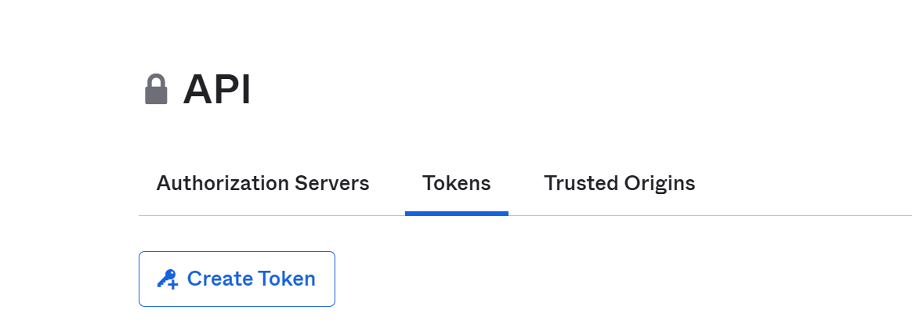
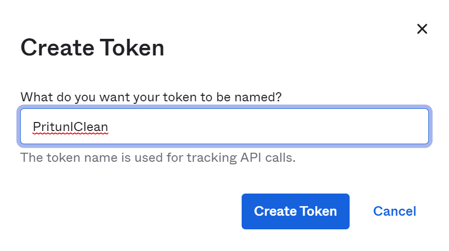
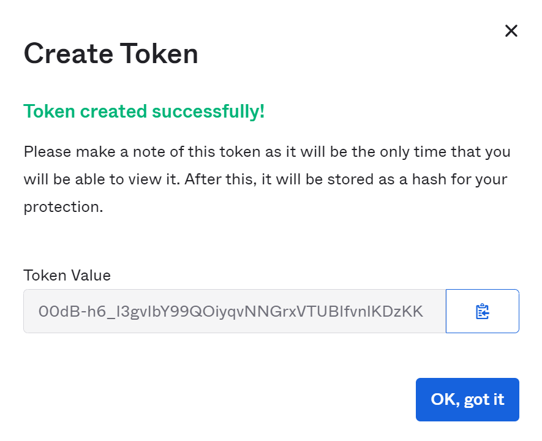
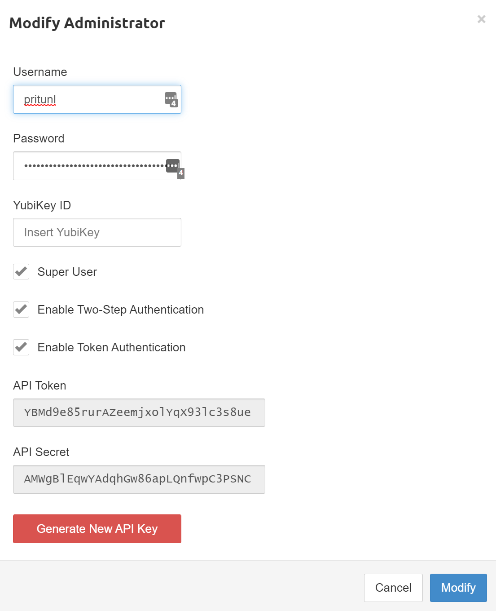
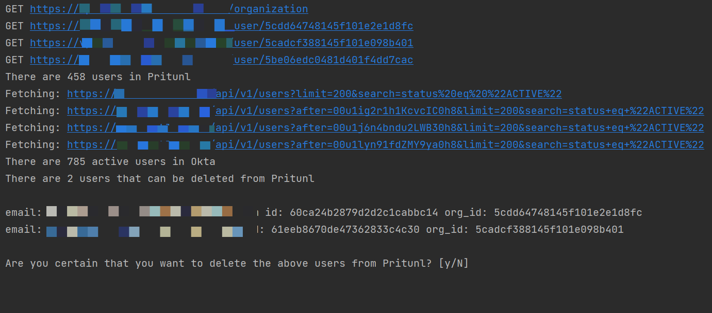

# Pritunl Okta deprovisioner
Pritunl VPN (https://pritunl.com) uses JIT (just in time) provisioning when it is configured to use Okta as an identity provider.
When a user gets removed from Okta it does not get removed from the Pritunl web console.

The clean.py script in this repository removes Pritunl user accounts that are no longer available in Okta.

# Prerequisites                                                  
- Download Python 3 from https://www.python.org/downloads/
- Install the requirements (i.e. pip install -r requirements.txt)
- Create an Okta API key (Okta admin portal -> Security - API Tokens<br/> 



- Create a Pritunl API key and API secret (Pritunl web console -> Administrators top menu -> select an administrator )

Select "Enable Token Authentication" to generate an API token and secret

# Running the cleanup script
You need to pass the created API keys and the domains that you are using for Okta and Pritunl.<br/>
Below you can see an example.<br/><br/>
```python clean.py --sso_domain https://company.okta.com --pritunl_domain https://vpn.company.com --okta_api_key 43Yh-DJHheerjlGHYUDGfk_4HEUjerh --pritunl_api_key YBmdsgy3497GJHD3ipdjlk8Ye --pritunl_api_secret UdfhljkYIEhsdreuiui898ty```<br/><br/>
If there are any users in Pritunl that do not exist in Okta the script will show this and ask you if you want to delete these users.
